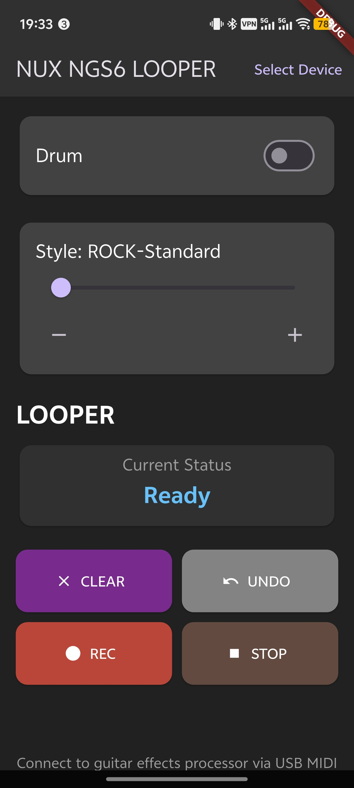

# NGS6 LOOPER Controller

[**中文说明**](README.zh-CN.md)

## About This App

This is a simple mobile application designed to control the Drum Machine and Looper functions of the NUX Amp Academy (NGS-6) effects pedal. I created this app as a personal hobby project because I found it inconvenient to access these features on the device itself or through the official PC software, and the official mobile app lacks this functionality entirely.

This app provides a straightforward and easy-to-use interface to manage the drum machine and looper, making it much more convenient for daily practice and jamming.

- **Official Product Page (CN):** [https://cn.nuxaudio.com/product/ampacademy/](https://cn.nuxaudio.com/product/ampacademy/)
- **Official Product Page (EN):** [https://nuxaudio.com/product/ampacademy/](https://nuxaudio.com/product/ampacademy/)

## Disclaimer

Please note that I am not a professional programmer, and this app was developed with significant assistance from AI. Therefore, it is provided "as is" and may have bugs or limitations. It serves its purpose but is not a polished, commercial product.

## Features

- **Drum Machine Control:**
    - Toggle the drum machine on/off.
    - Select from 67 different drum styles, with clear names displayed (e.g., "ROCK - Standard").
    - Adjust drum volume.
- **Advanced Looper Control:**
    - Standard controls: Record, Play, Stop, and Clear.
    - Multi-layer dubbing with Undo/Redo functionality for the last layer.
- **Real-time UI Sync:**
    - The app listens to MIDI feedback from the device to update the UI in real-time.
    - Button states (e.g., REC, PLAY, DUB) dynamically change and blink to reflect the pedal's actual status.
    - A dedicated status display shows the current looper state (e.g., "Recording Layer 1", "Playing", "Dubbing Layer 2").
- **Timer and Progress Bar:**
    - A timer is displayed during the initial recording to track the loop length.
    - A progress bar shows the current playback position of the loop.

## Future Improvements

- **State Persistence:** Save the last used drum style and other settings.
- **UI/UX Enhancements:** Further improve the user interface and overall user experience.
- **Error Handling:** Implement more robust error handling for device connection issues.
---

## 💖 Support Me

If you find this project helpful, please consider supporting me to keep it maintained and evolving. Thank you for your support!

### ☕️ Ko-fi

### Alipay & WeChat

 