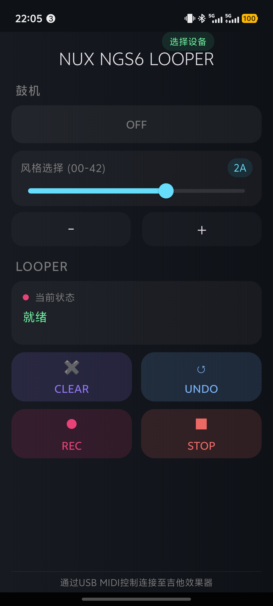

# NGS6 LOOPER Controller

## English

### About This App

This is a simple mobile application designed to control the Drum Machine and Looper functions of the NUX Amp Academy (NGS-6) effects pedal. I created this app as a personal hobby project because I found it inconvenient to access these features on the device itself or through the official PC software, and the official mobile app lacks this functionality entirely.

This app provides a straightforward and easy-to-use interface to manage the drum machine and looper, making it much more convenient for daily practice and jamming.

- **Official Product Page (CN):** [https://cn.nuxaudio.com/product/ampacademy/](https://cn.nuxaudio.com/product/ampacademy/)
- **Official Product Page (EN):** [https://nuxaudio.com/product/ampacademy/](https://nuxaudio.com/product/ampacademy/)

### Disclaimer

Please note that I am not a professional programmer, and this app was developed with significant assistance from AI. Therefore, it is provided "as is" and may have bugs or limitations. It serves its basic purpose but is not a polished, commercial product.

### Features

- Control the drum machine on/off and style selection.
- Basic LOOPER controls: Record, Play, Stop, Clear, and Undo/Redo.

### TODO / Future Improvements

The current version has a known limitation: it does not yet fully process MIDI feedback from the device to update the UI in real-time. This means the app can send commands, but the button states (e.g., REC, PLAY, DUB) and the looper status display do not dynamically reflect the pedal's actual state.

The following features are planned for future releases:
-   **Real-time Looper Status:** Implement full MIDI feedback monitoring to dynamically update button labels, states (e.g., blinking), and the status display based on signals received from the pedal.
-   **State Persistence:** Save the last used drum style and other settings.
-   **UI Enhancements:** Improve the user interface and overall user experience.

For more details, you can refer to the [LOOPER_MIDI_ENHANCEMENT_PLAN.md](LOOPER_MIDI_ENHANCEMENT_PLAN.md) file.

---

## 中文

### 关于此应用

这是一个简单的移动端应用，用于控制 NUX Amp Academy (NGS-6) 效果器的鼓机和乐句循环（LOOPER）功能。我开发这个应用纯粹是个人爱好，因为我发现直接在设备上或者通过官方电脑软件操作这些功能很不方便，而官方的移动应用则完全没有提供这些功能的控制界面。

这个应用提供了一个简单直观的界面来管理鼓机和乐句循环，为日常练习和演奏带来了极大的便利。

- **官方产品页面（中文）:** [https://cn.nuxaudio.com/product/ampacademy/](https://cn.nuxaudio.com/product/ampacademy/)
- **官方产品页面（英文）:** [https://nuxaudio.com/product/ampacademy/](https://nuxaudio.com/product/ampacademy/)

### 免责声明

请注意，我不是一名专业的程序员，这个应用是在 AI 的大量协助下完成的。因此，本应用按“原样”提供，可能存在缺陷或功能限制。它能满足基本的使用需求，但并非一个完善的商业产品。

### 功能

-   控制鼓机的开关及风格选择。
-   基础的乐句循环（LOOPER）控制：录音、播放、停止、清除和撤销/重做。

### 待办事项 / 未来计划

当前版本有一个已知的功能局限：应用尚未完全实现对设备MIDI回传信号的处理，因此无法实时更新界面状态。这意味着App可以发送控制指令，但按钮的状态（例如：REC, PLAY, DUB）和乐句循环的状态显示区域，并不能根据效果器的实际状态进行动态调整。

计划在未来的版本中加入以下功能：
-   **实时乐句循环状态同步:** 实现完整的MIDI信号回传监控，根据从效果器接收到的信号动态
