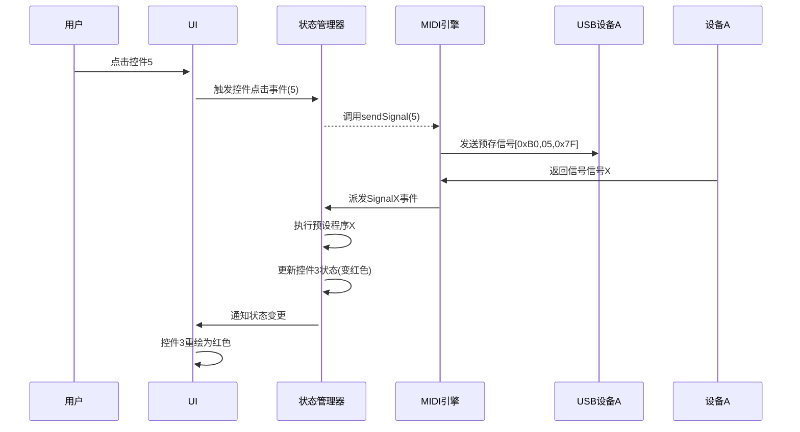

针对Flutter开发USB MIDI应用的方案设计，以下是模块划分和运行逻辑建议：

### 1. 代码模块切分
#### a) 权限管理模块 (`permission_handler.dart`)
- **职责**：
  - 使用`flutter_usb`插件请求USB访问权限
  - 扫描并过滤MIDI设备列表（使用设备PID/VID标识）
  - 获取用户指定的设备A的读写权限
- **交互**：
  - 向主页面返回设备列表和权限状态
  - 缓存已授权设备信息避免重复请求

#### b) MIDI通信引擎 (`midi_engine.dart`)
- **发送子模块**：
  - 封装8个固定MIDI信号（如`sendControlSignal(int controlIndex)`）
  - 每个控件绑定唯一信号（例：控件1发送`[0xB0, 0x01, 0x7F]`）
- **接收子模块**：
  - 开启设备A的监听流（`onMidiDataReceived`）
  - 信号解析器：将原始字节转换为预定义信号ID（如`0xF030 → SignalX`）
  - 信号分发：通过Stream/EventBus传递有效信号

#### c) 状态管理核心 (`state_manager.dart`)
- **采用BLoC/Cubit方案**：
  - 定义`AppState`包含所有控件的状态数据（颜色、文字等）
  - 处理两种事件：
  1. **用户交互事件**：控件点击 → 触发MIDI发送
        B0    29    01  控件drum 点击前lable为drum off/或者通过明暗、高亮等方式来识别
        B0    29    00  控件drum 点击前lable为drum off/或者通过明暗、高亮等方式来识别
        B0    2A    00到042   控件drum style， 选择很多，16进制从 00-42 共67种
        drum style通过两种方式操作，a：拖动条快速选择，b：拖动条下方+-按钮步进选择
        B0    2D    01       控件rec
        B0    2D    04       控件clear
        B0    2D    02       控件stop
        B0    2D    08       控件undo

  2. **信号响应事件**：收到信号X → 更新对应控件状态
        B0    2D    09  rec控件label变为wait rec
        B0    2D    01  rec控件label变为recording，闪烁
        B0    2D    02  rec控件label变为playing，闪烁
        B0    2D    03  rec控件label变为duo rec，闪烁
        B0    2D    12  rec控件label变为playing，闪烁
        B0    2D    22  undo控件label变为redo
        B0    2D    12  undo控件label变为undo
        B0    2D    04  rec控件label变为play，无闪烁
        B0    2D    00  rec控件label变为rec，无闪烁

        这里有一点顺序问题，接收到下面的信号：
        B0    2D    03  表示正在duo rec，建议显示为正在叠加第2层录音
        B0    2D    12  表示duo rec完成，建议显示为第2层录音完成录音，playing
        再次收到
        B0    2D    03  表示正在duo rec，建议显示为正在叠加第3层录音
        B0    2D    12  表示duo rec完成，建议显示为第3层录音完成录音，playing

        undo控件的lable默认是undo
        假设只有1层录音，点击它是无用的
        当大于2层录音时，点击它会删除最上层的录音，此时设备会回传B0    2D    22，表示最上层录音被删除，此时undo的控件lable变成redo
        如果点击它会恢复刚才被删除的录音，此时设备会回传B0    2D    12，此时lable会恢复为undo

        现在有个问题是，B0    2D    12这个信号关联了显示区的显示，又关联了undo控件的显示，且有一定的冲突，我不知道怎么修改比较好


在LooperStatusWidget区域，我希望增加有一个计时，在录制第一层的时候，开始录音后开始计时，计时我希望有显示，结束录音并播放时，显示一个进度条


- **状态映射**：
  - 维护`Map<MidiSignal, Function>` 关联信号与处理逻辑
  - 例：信号X → `_updateButtonColor(buttonId)`


#### d) UI层 (`main_ui.dart`)
- **控件组件**：
  - 创建无状态控件组件（`MidiControlWidget`）
  - 通过`BlocBuilder`关联状态管理器的数据
  - 点击事件：调用刚刚写程序
- **布局结构**：
  结构布局按你刚刚的分析进行

### 2. 运行逻辑流程


### 3. 关键设计要点
1. **权限生命周期**：
   - App启动时自动尝试重连已授权设备
   - 设备拔出时自动暂停监听流
   - 提供手动设备扫描按钮

2. **信号处理优化**：
   - MIDI接收使用`Stream`缓冲队列，避免丢包
   - 信号解析使用位运算（例：`data[1] & 0xF0`取指令类型）
   - 为高频信号设计防抖机制

3. **状态更新策略**：
   - UI控件完全依赖状态管理器的数据
   - 信号响应程序仅修改状态属性（纯函数）
   - 复杂变更使用`copyWith`确保不可变性

4. **异常处理**：
   - USB通信超时自动重试（指数退避算法）
   - 未知MIDI信号过滤日志
   - 提供设备连接错误Toast提示

### 4. 模块依赖关系
```
ui_layer（界面）
└─── state_manager（状态核心）
     ├── midi_engine（MIDI通信）
     │   └── permission_handler（权限）
     └── event_bus（信号传递）
```

此设计满足需求：
- 权限获取与设备管理解耦
- MIDI收发与业务逻辑分离
- UI完全由状态驱动更新
- 扩展性强（新增信号只需在状态管理器注册处理函数）